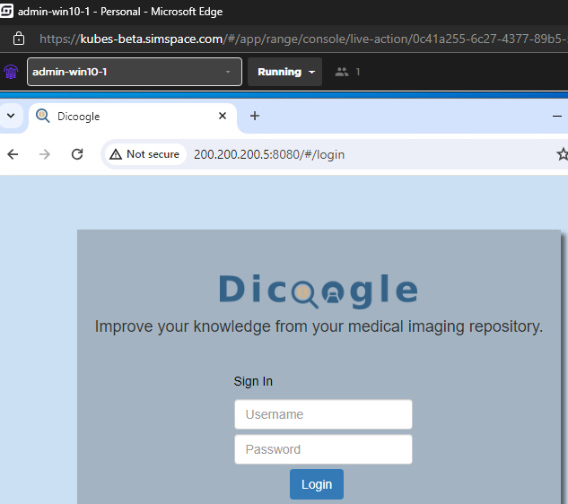
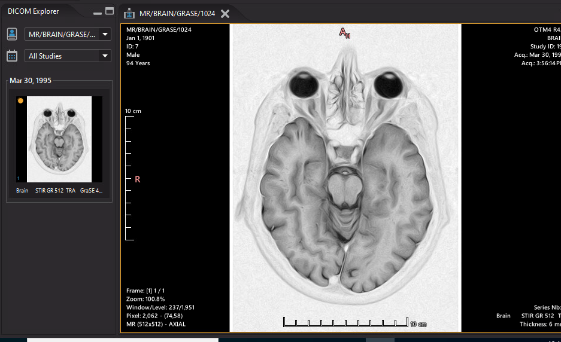
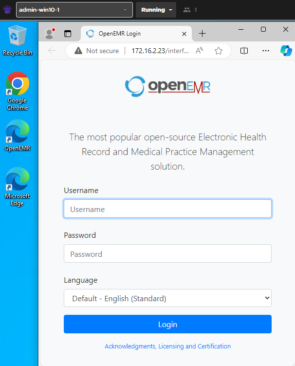
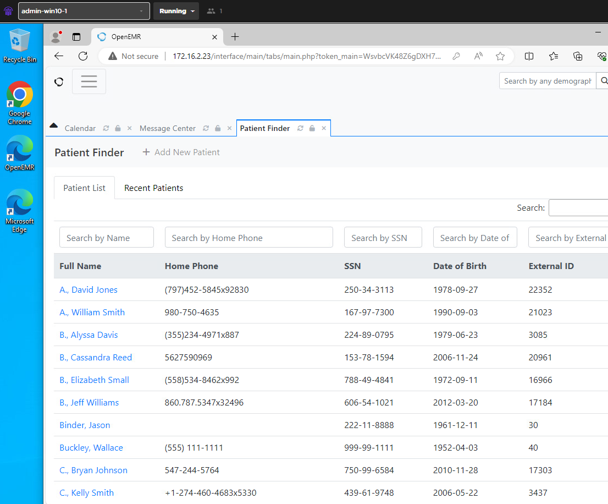

# HOSPITAL
This repository contains hospital related work for Simspace ranges.

## Containers
- DICOM
  - Weasis: The Weasis Medical Viewer used to view DICOM files.
  - Dicoogle: A dicom image repository server with Lucene and file-storeage plugins. Open source DICOM files can be found in /images.
- EMR
  - OpenEMR: OpenEMR is the most popular open source electronic health records and medical practice management solution. 
  

# Picture Archival and Communication System (PACS)
The PACS consists of a cloud storage solution called Dicoogle. The Dicoogle instance is running in a Docker container that is hosted in the Internet subnet of the range. Dicoogle contains DICOM images collected from open source repositories which can be searched for images of interest. The default credentials are “dicoogle/dicoogle”.

A DICOM Viewer is required to query, download, and view images. The Weasis DICOM Viewer is installed on clients which would require this functionality, such as the VMs in the radiology subnet. Weasis should be configured to query Dicoogle remotely:

# Electronic Medical Records (EMR)
The records, billing, and scheduling functions are handled by OpenEMR, an open-source electronic medical records solution.Both the MySQL database and OpenEMR web service are running in Docker containers hosted in the Servers subnet. The VMs in the records and admin subnets were configured to contain a shortcut on the desktop for access. The default administration credentials are “admin/pass”.

 AI was used to populate OpenEMR’s database with patient data:

